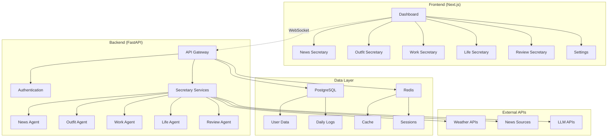

# AI Life Assistant Web App - Design Document

## Overview

The AI Life Assistant Web App transforms the existing command-line AI secretary system into a modern, responsive web application. The design follows a modular architecture with a React-based frontend and FastAPI backend, maintaining full compatibility with the existing Python agents while providing an enhanced user experience through intuitive interfaces, real-time updates, and comprehensive data visualization.

## Architecture

### High-Level Architecture



### Technology Stack

**Frontend:**
- Next.js 14 with App Router
- React 18 with TypeScript
- Shadcn/ui + Radix UI components
- Tailwind CSS for styling
- Framer Motion for animations
- Recharts for data visualization
- Zustand for state management

**Backend:**
- FastAPI with Python 3.11+
- SQLAlchemy with PostgreSQL
- Redis for caching and sessions
- WebSocket support for real-time updates
- Celery for background tasks

**Infrastructure:**
- Docker containers for deployment
- Vercel for frontend hosting
- Railway/Render for backend hosting
- Supabase for database hosting

## Components and Interfaces

### Frontend Components

#### Core Layout Components
- **AppLayout**: Main application shell with navigation
- **Sidebar**: Collapsible navigation with secretary links
- **Header**: Top bar with user info and theme toggle
- **Footer**: Application info and status indicators

#### Dashboard Components
- **DashboardGrid**: Responsive grid layout for widgets
- **WeatherWidget**: Current weather and forecast display
- **TaskSummaryWidget**: Today's task progress overview
- **HealthWidget**: Health metrics and goal progress
- **QuickActionsWidget**: One-click secretary access buttons

#### Secretary-Specific Components
- **NewsCard**: Individual news article display
- **OutfitRecommendation**: Outfit suggestion with weather context
- **TaskManager**: Drag-and-drop task management interface
- **HealthDashboard**: Comprehensive health tracking display
- **ReflectionInterface**: Interactive reflection and review system

#### Shared UI Components
- **LoadingSpinner**: Consistent loading indicators
- **ErrorBoundary**: Error handling and recovery
- **ToastNotification**: System notifications and alerts
- **ConfirmDialog**: User confirmation dialogs
- **DataChart**: Reusable chart components

### Backend API Interfaces

#### Authentication Endpoints
```typescript
POST /api/auth/login
POST /api/auth/logout
POST /api/auth/refresh
GET /api/auth/me
```

#### Secretary Service Endpoints
```typescript
// News Secretary
GET /api/news/briefing
GET /api/news/sources
POST /api/news/generate

// Outfit Secretary
GET /api/outfit/recommendation
GET /api/outfit/weather
POST /api/outfit/generate

// Work Secretary
GET /api/work/tasks
POST /api/work/tasks
PUT /api/work/tasks/:id
DELETE /api/work/tasks/:id

// Life Secretary
GET /api/life/health
POST /api/life/health
GET /api/life/goals
POST /api/life/goals

// Review Secretary
GET /api/review/questions
POST /api/review/reflection
GET /api/review/insights
```

#### WebSocket Events
```typescript
// Real-time updates
'task_updated'
'health_data_changed'
'news_available'
'system_notification'
```

## Data Models

### User Model
```typescript
interface User {
  id: string;
  email: string;
  name: string;
  preferences: UserPreferences;
  apiKeys: ApiKeys;
  createdAt: Date;
  updatedAt: Date;
}

interface UserPreferences {
  theme: 'light' | 'dark';
  language: string;
  notifications: NotificationSettings;
  dashboardLayout: DashboardLayout;
}
```

### Secretary Data Models
```typescript
interface NewsItem {
  id: string;
  title: string;
  source: string;
  url: string;
  summary: string;
  importance: number;
  publishedAt: Date;
  tags: string[];
}

interface Task {
  id: string;
  title: string;
  description: string;
  priority: 'high' | 'medium' | 'low';
  status: 'pending' | 'in_progress' | 'completed';
  estimatedTime: number;
  dueDate?: Date;
  createdAt: Date;
}

interface HealthMetric {
  id: string;
  type: 'weight' | 'exercise' | 'sleep' | 'water';
  value: number;
  unit: string;
  recordedAt: Date;
  notes?: string;
}

interface OutfitRecommendation {
  id: string;
  weather: WeatherData;
  recommendation: {
    top: string;
    bottom: string;
    shoes: string;
    accessories: string[];
  };
  reasoning: string;
  imageUrl?: string;
  createdAt: Date;
}
```

## Correctness Properties

*A property is a characteristic or behavior that should hold true across all valid executions of a system-essentially, a formal statement about what the system should do. Properties serve as the bridge between human-readable specifications and machine-verifiable correctness guarantees.*

### Property Reflection

After reviewing all identified properties, I've consolidated redundant ones and ensured each provides unique validation value:

- Combined multiple loading state properties into a single comprehensive property
- Merged similar error handling properties across different modules
- Consolidated theme consistency checks into one property
- Combined real-time update properties for different data types

### Core System Properties

**Property 1: Responsive Design Consistency**
*For any* viewport size between 320px and 2560px width, the Web_App should maintain functional layout and readable content without horizontal scrolling
**Validates: Requirements 1.1**

**Property 2: Performance Threshold Compliance**
*For any* standard network connection, the Web_App should complete initial page load within 3 seconds
**Validates: Requirements 1.2**

**Property 3: Navigation State Persistence**
*For any* navigation between pages, the Web_App should preserve user input data and application state
**Validates: Requirements 1.3**

**Property 4: UI Feedback Responsiveness**
*For any* user interaction (click, tap, keyboard input), the Web_App should provide visual feedback within 100ms
**Validates: Requirements 1.4**

**Property 5: Theme Consistency**
*For any* theme switch operation, all UI components should reflect the new theme within 200ms
**Validates: Requirements 1.5**

### Data Management Properties

**Property 6: Real-time Update Propagation**
*For any* data change event, the Web_App should update all affected UI components automatically without user intervention
**Validates: Requirements 2.3, 4.1**

**Property 7: Preference Persistence**
*For any* user preference modification, the Web_App should save the change immediately and restore it on subsequent visits
**Validates: Requirements 2.4, 6.2**

**Property 8: Loading State Management**
*For any* asynchronous operation, the Web_App should display appropriate loading indicators and handle completion or failure gracefully
**Validates: Requirements 2.5, 4.2, 4.4**

### Interactive Features Properties

**Property 9: Chart Interactivity**
*For any* data visualization chart, user interactions should provide hover details and maintain responsive behavior
**Validates: Requirements 5.5**

**Property 10: Notification Consistency**
*For any* system event or user action, notification settings should be respected across all application modules
**Validates: Requirements 4.3, 6.3**

### Data Integrity Properties

**Property 11: Data Export Completeness**
*For any* data export operation, the generated file should contain all user data in the specified format without corruption
**Validates: Requirements 6.4**

**Property 12: Data Import Validation**
*For any* data import operation, the Web_App should validate data integrity and merge safely without data loss
**Validates: Requirements 6.5**

### Offline Functionality Properties

**Property 13: Offline State Management**
*For any* offline condition, the Web_App should display cached data and clearly indicate offline status and limitations
**Validates: Requirements 7.1, 7.4**

**Property 14: Offline Synchronization**
*For any* changes made offline, the Web_App should queue modifications and sync automatically when connectivity is restored
**Validates: Requirements 7.2, 7.3**

### Backend API Properties

**Property 15: Authentication Consistency**
*For any* API request, the backend should properly authenticate and authorize users according to their permissions
**Validates: Requirements 8.1**

**Property 16: Agent Compatibility**
*For any* AI secretary operation, the API should produce results equivalent to the existing Python command-line agents
**Validates: Requirements 8.2**

**Property 17: Concurrent Request Handling**
*For any* set of concurrent API requests, the backend should process them without data corruption or resource conflicts
**Validates: Requirements 8.3**

**Property 18: Data Integrity Assurance**
*For any* data storage operation, the backend should maintain data integrity and provide recovery mechanisms
**Validates: Requirements 8.4**

**Property 19: Error Response Consistency**
*For any* error condition, the backend should log detailed information and return appropriate HTTP status codes with helpful messages
**Validates: Requirements 8.5**

## Error Handling

### Frontend Error Handling
- **Network Errors**: Retry mechanisms with exponential backoff
- **API Errors**: User-friendly error messages with recovery suggestions
- **Validation Errors**: Real-time form validation with clear feedback
- **Runtime Errors**: Error boundaries to prevent application crashes
- **Offline Errors**: Graceful degradation with offline indicators

### Backend Error Handling
- **Authentication Errors**: Clear 401/403 responses with refresh token logic
- **Validation Errors**: Detailed 422 responses with field-specific messages
- **Server Errors**: Comprehensive logging with error tracking
- **Rate Limiting**: 429 responses with retry-after headers
- **Database Errors**: Transaction rollback and data consistency checks

### Error Recovery Strategies
- **Automatic Retry**: For transient network and server errors
- **Manual Retry**: User-initiated retry buttons for failed operations
- **Fallback Data**: Cached or default data when live data is unavailable
- **Progressive Enhancement**: Core functionality works even when advanced features fail

## Testing Strategy

### Unit Testing
- **Component Testing**: React component behavior and rendering
- **API Testing**: Backend endpoint functionality and validation
- **Utility Testing**: Helper functions and data transformations
- **Integration Testing**: Frontend-backend communication

### Property-Based Testing
- **Property Testing Library**: fast-check for JavaScript/TypeScript
- **Test Configuration**: Minimum 100 iterations per property test
- **Property Test Coverage**: All 19 correctness properties must be implemented
- **Test Tagging**: Each property test tagged with format: `**Feature: web-app, Property {number}: {property_text}**`

### End-to-End Testing
- **User Journey Testing**: Complete workflows from login to task completion
- **Cross-Browser Testing**: Chrome, Firefox, Safari, Edge compatibility
- **Mobile Testing**: Touch interactions and responsive behavior
- **Performance Testing**: Load times and resource usage monitoring

### Testing Tools
- **Frontend**: Jest, React Testing Library, Cypress
- **Backend**: pytest, FastAPI TestClient
- **Property Testing**: fast-check for frontend, Hypothesis for backend
- **E2E Testing**: Playwright for cross-browser testing
- **Performance**: Lighthouse CI for performance monitoring