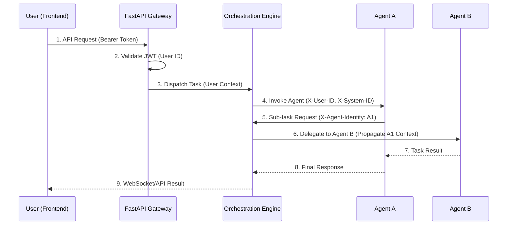

# work-agents 架构设计文档

## 1. 系统架构概览

```
┌─────────────────────────────────────────────────────────────┐
│                        用户界面层                             │
│  ┌──────────────────┐         ┌──────────────────┐          │
│  │  前台网站 (Next.js) │         │  管理后台 (Next.js) │          │
│  │  - Home           │         │  - Agents 管理    │          │
│  │  - Agents         │         │  - Blog 管理      │          │
│  │  - Tools          │         │  - Tools 管理     │          │
│  │  - Labs           │         │  - Labs 管理      │          │
│  │  - Blog           │         │  - Settings       │          │
│  └──────────────────┘         └──────────────────┘          │
└─────────────────────────────────────────────────────────────┘
                            ↓
┌─────────────────────────────────────────────────────────────┐
│                        API 网关层                             │
│                   Next.js API Routes                          │
│                   (可选中间层/代理)                           │
└─────────────────────────────────────────────────────────────┘
                            ↓
┌─────────────────────────────────────────────────────────────┐
│                    消息与编排层                               │
│              WebSocket Server + Orchestration Engine          │
│  ┌─────────────────┐  ┌─────────────────┐  ┌──────────────┐    │
│  │  WebSocket      │  │  Agent          │  │  Redis       │    │
│  │  Server         │  │  Orchestration  │  │  Pub/Sub     │    │
│  │  (实时通信)      │  │  Engine        │  │  (扩展背板)   │    │
│  │  └──────────────┘  └─────────────────┘  └──────────────┘    │
└─────────────────────────────────────────────────────────────┘

                            ↓
┌─────────────────────────────────────────────────────────────┐
│                      业务逻辑层                               │
│                     FastAPI Backend                           │
│  ┌────────────┐  ┌────────────┐  ┌────────────┐             │
│  │ Auth Service│  │ CRUD Service│  │ File Service│             │
│  └────────────┘  └────────────┘  └────────────┘             │
└─────────────────────────────────────────────────────────────┘
                            ↓
┌─────────────────────────────────────────────────────────────┐
│                      数据访问层                               │
│                   SQLAlchemy ORM                              │
└─────────────────────────────────────────────────────────────┘
                            ↓
┌─────────────────────────────────────────────────────────────┐
│                      数据存储层                               │
│  ┌──────────────┐  ┌──────────────┐  ┌──────────────┐       │
│  │   SQLite DB   │  │ 本地文件存储   │  │ 内存缓存 (PY) │       │
│  │(work_agents.db)│  │(/public/ups) │  │ (Polling)    │       │
│  └──────────────┘  └──────────────┘  └──────────────┘       │
└─────────────────────────────────────────────────────────────┘
```

## 2. 技术栈详解

> **相关文档**:
>
> - [OpenSpec 项目上下文](../../openspec/project.md) - 技术栈定义的单一致真源
> - [OpenSpec AI 规范](../../openspec/AGENTS.md) - 开发规范与约束

### 2.1 前端技术栈

| 技术            | 版本   | 用途                      |
| --------------- | ------ | ------------------------- |
| Next.js         | 15.5   | React 框架，SSR/SSG       |
| React           | 19.1   | UI 库                     |
| TypeScript      | 5.x    | 类型安全                  |
| Tailwind CSS    | 3.x    | 样式框架 (Genesis Tokens) |
| Shadcn/UI       | latest | 基础组件库                |
| Framer Motion   | 6.x+   | 物理动效/磁力交互/Glitch  |
| TanStack Query  | 5.x    | 数据获取和轮询 (Polling)  |
| Zustand         | 4.x    | 状态管理                  |
| React Hook Form | 7.x    | 表单管理                  |
| Zod             | 3.x    | Schema 验证               |

### 2.3 AI 增强技术栈

_本项目深度集成 AI 协作流程_

| 技术           | 用途                                       |
| -------------- | ------------------------------------------ |
| **OpenSpec**   | 规范驱动开发 (Spec-driven Development)     |
| **MCP**        | Model Context Protocol (Fetch/Search 集成) |
| **Prometheus** | 规划代理 (Task Scaffolding)                |
| **Sisyphus**   | 执行代理 (Code/Doc Implementation)         |

### 2.2 后端技术栈

| 技术        | 版本   | 用途       |
| ----------- | ------ | ---------- |
| Python      | 3.11+  | 编程语言   |
| FastAPI     | 0.109+ | Web 框架   |
| SQLAlchemy  | 2.0+   | ORM        |
| Alembic     | 1.13+  | 数据库迁移 |
| Pydantic    | 2.5+   | 数据验证   |
| python-jose | 3.3+   | JWT 处理   |
| passlib     | 1.7+   | 密码加密   |
| pytest      | 7.4+   | 测试框架   |

## 3. 目录结构设计

根据 `GEMINI.md` 标准及 `Genesis` 版迭代需求，系统目录结构设计如下。

### 3.0 项目全局目录

```
.
├── backend/            # FastAPI 后端项目
├── frontend/           # Next.js 前端项目 (Genesis Edition)
├── docs/               # 项目文档资产
│   ├── design/         # 设计文档 (架构、API、数据库、前端规范)
│   ├── development/    # 开发指南 (环境、工作流)
│   └── planning/       # 项目规划 (需求、路线图)
├── openspec/           # Spec-driven 开发规范中心
│   ├── specs/          # 现状 (Single Source of Truth)
│   ├── changes/        # 功能提案 (Proposals)
│   └── project.md      # 项目全局上下文
├── scripts/            # 全入口运营/运维脚本 (REQUIRED)
├── logs/               # 运行日志 (No-sensitive, gitignored)
├── .sisyphus/          # 执行代理工作状态 (Opaque)
└── .agent/             # AI 助手私有配置
```

### 3.1 后端目录结构 (backend/)

```
backend/
├── alembic/                # 数据库迁移记录 (DB Schema v1.2)
│   ├── versions/           # 迁移版本文件
│   └── env.py              # 迁移环境配置
├── alembic.ini             # Alembic 配置文件
├── data/                   # 数据库与持久化层 (REQUIRED)
│   └── work_agents.db      # SQLite 主数据库文件
├── src/                    # 核心源码目录
│   ├── api/                # 接口路由层
│   │   ├── v1/             # 基础业务 API (Auth, Home, Agents...)
│   │   │   ├── admin/      # 管理后端专用接口 (CRUD)
│   │   │   │   ├── agents.py
│   │   │   │   ├── blog.py
│   │   │   │   ├── tools.py
│   │   │   │   ├── labs.py
│   │   │   │   └── media.py
│   │   │   └── __init__.py
│   │   └── deps.py         # 依赖注入 (DB Session, Auth)
│   ├── core/               # 核心系统配置
│   │   ├── config.py       # Pydantic Settings
│   │   ├── security.py     # JWT & Hashing
│   │   ├── database.py     # SQLAlchemy Engine/Session
│   │   └── websocket.py    # WebSocket 服务配置
│   ├── models/             # 数据库 ORM 模型
│   │   ├── user.py         # 用户模型
│   │   ├── agent.py        # 智能体模型
│   │   ├── blog_post.py    # 博客文章模型
│   │   ├── tag.py          # 标签模型
│   │   ├── tool.py         # 工具模型
│   │   ├── category.py     # 分类模型
│   │   ├── lab.py          # 实验室模型
│   │   ├── agent_message.py # 智能体消息模型
│   │   └── agent_memory.py  # 智能体记忆模型
│   ├── schemas/            # Pydantic 数据模型 (DTOs)
│   ├── services/           # 业务逻辑服务层
│   │   ├── auth_service.py  # 认证服务
│   │   ├── user_service.py  # 用户服务
│   │   ├── agent_service.py # 智能体服务
│   │   ├── blog_service.py  # 博客服务
│   │   ├── tool_service.py  # 工具服务
│   │   ├── lab_service.py   # 实验室服务
│   │   └── file_service.py  # 文件服务
│   ├── utils/              # 通用工具函数
│   │   ├── helpers.py      # 辅助函数
│   │   └── validators.py   # 验证器
│   └── main.py             # FastAPI 应用入口
├── tests/                  # 自动化测试 (pytest)
├── .env.example            # 环境变量模板
├── pyproject.toml          # 项目元数据
└── requirements.txt        # Python 依赖包列表
```

### 3.2 前端目录结构 (frontend/)

```
frontend/
├── src/
│   ├── app/                # App Router (Next.js 15)
│   │   ├── (frontend)/     # 前台页面 (Home, Agents, Tools, Labs, Blog)
│   │   ├── (dashboard)/    # 管理后台 (Dashboard, Admin CRUD, Settings)
│   │   ├── auth/           # 认证流程 (Login/Register)
│   │   ├── layout.tsx      # 根布局 (Genesis Theme)
│   │   └── globals.css     # 全局样式 (Tailwind 4 & Genesis Variables)
│   ├── components/         # React 组件库
│   │   ├── ui/             # Shadcn/UI 基础组件
│   │   ├── layout/         # Navbar, Footer, Sidebar
│   │   └── features/       # 功能组件 (ParticleBg, OnlinePulse)
│   ├── lib/                # 核心库 (API Client, Utils)
│   ├── hooks/              # 自定义 React Hooks
│   ├── store/              # 状态管理 (Zustand)
│   ├── types/              # TypeScript 类型定义
│   ├── utils/              # 通用工具函数
│   ├── services/           # API 服务封装
│   └── constants/          # 常量配置
├── public/                 # 静态资源
│   └── uploads/            # 用户上传的媒体文件
├── design-assets/          # 设计资产 (UI/UX 设计稿)
├── next.config.ts          # Next.js 配置文件
└── tailwind.config.ts      # Genesis 设计令牌配置
```

## 4. 数据流设计

### 4.1 认证流程

```
┌──────────┐     1. 登录请求      ┌──────────┐
│          │ ──────────────────→ │          │
│  前端     │                     │  后端     │
│  (Next.js)│ ←────────────────── │ (FastAPI)│
│          │  2. 返回 JWT Token   │          │
└──────────┘                     └──────────┘
     │                                 ↑
     │ 3. 存储 Token                   │
     │ (LocalStorage/Cookie)           │
     ↓                                 │
  后续请求                             │
     │ 4. 携带 Token                   │
     │ (Authorization Header)          │
     └─────────────────────────────────┘
```

### 4.2 CRUD 数据流

```
┌──────┐     ┌──────┐     ┌────────┐     ┌──────┐
│ UI   │ ──→ │ API  │ ──→ │ Service│ ──→ │ Model│
│ Layer│ ←── │ Route│ ←── │ Layer  │ ←── │ (DB) │
└──────┘     └──────┘     └────────┘     └──────┘
  前端         后端         业务逻辑       数据库
```

## 5. API 设计原则

### 5.1 RESTful 规范

- **资源命名**: 使用名词复数 (`/agents`, `/blogs`)
- **HTTP 方法**: GET (查询), POST (创建), PUT (更新), DELETE (删除)
- **状态码**: 200 (成功), 201 (创建), 400 (错误), 401 (未登录), 403 (无权限), 404 (不存在)

### 5.2 统一响应格式

```typescript
// 成功响应
{
  "success": true,
  "data": { ... },
  "meta": {
    "page": 1,
    "per_page": 20,
    "total": 100
  }
}

// 错误响应
{
  "success": false,
  "error": {
    "code": "VALIDATION_ERROR",
    "message": "Invalid input",
    "details": [ ... ]
  }
}
```

## 6. 安全设计

### 6.1 认证方案

- **JWT Token**: 短期访问令牌 (30分钟)
- **Refresh Token**: 长期刷新令牌 (7天)
- **密码加密**: bcrypt 加密存储

### 6.2 身份传播 (Identity Propagation)

- **跨 Agent 身份同步**: 基于 JWT 的统一身份协议，支持在多 Agent 间传递身份上下文
- **统一认证凭证**: 用户身份通过 Orchestration Engine 在不同服务间传递
- **会话一致性**: 维护用户在多个 Agent 间的会话连续性

#### 6.2.1 身份流转时序图



### 6.2 权限控制

- **RBAC**: 基于角色的访问控制
- **角色等级**: admin > editor > viewer
- **API 守卫**: 装饰器/中间件校验权限

### 6.3 数据安全

- **速率限制 (Rate Limiting)**:
  - 登录接口: 同一 IP 限制 10 次/分钟。
  - 全局 API: 限制 100 次/分钟。
- **SQL 注入**: 使用 SQLAlchemy 参数化查询。
- **XSS 防护**: Content Security Policy (CSP) + 前端转义。
- **CSRF 防护**: SameSite Cookie 策略。

## 7. 性能优化策略

### 7.1 前端优化

- **代码分割**: Next.js 自动代码分割
- **懒加载**: 图片和组件懒加载
- **缓存策略**: TanStack Query 缓存
- **CDN**: 静态资源 CDN 加速

### 7.2 后端优化

- **并发处理**: 对于 SQLite 写操作，使用 FastAPI/SQLAlchemy 串行化队列。
- **数据库索引**: 针对 `slug`, `category_id`, `published_at` 建立索引。
- **实时通信优化**: Labs 在线人数组件使用 WebSocket 实现实时双向通信，替代传统轮询机制。
- **WebSocket 服务**: 维护客户端连接池，处理实时消息广播与状态更新。
- **缓存层**: 应用层内存缓存热点数据 (如 Tools/Agents 列表)。

## 11. 伸缩性与高可用设计

### 11.1 WebSocket 横向扩展

当系统需要处理数万名在线用户时，单个 WebSocket 节点将达到物理瓶颈。本项目采用 Redis Pub/Sub 作为消息背板：

- **无状态节点**: 每一个 Backend 实例都是对等的。
- **消息路由**: 当 Agent A 需要向用户 U 发送消息时，它会将消息发布到 Redis 通道中。
- **本地分发**: 拥有用户 U 活跃连接的节点订阅该通道，并在本地完成推送。

### 11.2 数据库演进

- **本地开发**: 使用 SQLite (文件锁限制并发)。
- **生产环境**: 切换至 PostgreSQL 以支持高并发写操作和更复杂的 JSONB 查询。
- **架构兼容**: 所有 Model 均基于 SQLAlchemy 2.0，确保零成本迁移。

## 8. 部署架构

```
┌────────────────────────────────────────────────────────┐
│                     Nginx (反向代理)                     │
│                         :80/:443                         │
└─────────────┬───────────────────────┬──────────────────┘
              │                       │
              ↓                       ↓
    ┌─────────────────┐    ┌─────────────────┐
    │   Next.js App   │    │  FastAPI App    │
    │   (Port 3001)   │    │  (Port 8001)    │
    └────────┬────────┘    └────────┬────────┘
             │                      │
             ↓                      ↓
    ┌────────────────────────────────────────┐
    │              持久化存储层                │
    │  - backend/data/work_agents.db (SQLite)│
    │  - frontend/public/uploads (Media)     │
    └────────────────────────────────────────┘
```

## 9. 设计系统集成 (Genesis Integration)

- **核心配方**: Abyss (#0a0a0f) + Electric Cyan (#00f2ff) + Neon Purple (#bc13fe)。
- **动效标准**:
  - 统一使用 `Spring` 物理引擎（stiffness: 100, damping: 20）。
  - Agent 跳转集成 `AgentBridge` 扫描线动效。
- **性能红线**: 首屏 LCP < 1.5s，API 响应 P95 < 200ms。

## 10. 实现规范参考 (Genesis v2.0)

以下规范来自 Genesis v2.0 实施标准：

### 后端系统要求

**认证层:**

- JWT 认证支持刷新令牌机制
- `/admin/*` 路由保护，基于角色的访问控制
- 速率限制：每 IP 每分钟 100 请求
- 会话管理和登出功能

**实时通信:**

- WebSocket 服务器实现
- 通过编排协议实现智能体间消息传递
- 连接池和客户端状态管理
- WebSocket 不可用时的降级机制

**数据库结构:**

- SQLite 数据库位置：`backend/data/work_agents.db`
- 数据表：users, agents, blogs, tools, labs 及关联关系
- 热点数据缓存层
- 预置数据：5 agents, 3 blogs, 3 tools, 3 labs

**API 端点:**

- RESTful API 满足所有前端数据需求
- 管理后台完整 CRUD 操作
- 图片和媒体文件上传端点
- 大数据集分页支持
- 结构化错误响应和 HTTP 状态码

**智能体编排:**

- 实现编排协议支持智能体间通信
- 协作期间智能体间上下文共享
- 健康监控和自动故障转移机制

### 基础设施与部署

- Docker 容器化，分离前端/后端/数据库服务
- 自动化 CI/CD 流水线集成测试
- 环境特定配置（dev/staging/prod）
- 数据库迁移策略支持 schema 更新
- SSL/HTTPS 强制和证书管理

### 质量保证

- 单元测试：业务逻辑最低 80% 覆盖率
- 集成测试：API 端点和数据库交互
- UI 测试：关键用户流程验证
- 性能测试：LCP < 1.5s, API P95 响应 < 200ms
- 安全扫描和漏洞评估

### 监控与可观测性

- 全服务可配置级别集中日志
- 关键问题错误追踪和告警
- API 响应时间和页面加载性能监控
- 基础设施监控健康检查端点
- 隐私合规的用户分析

### 安全措施

- 所有入口点输入验证和消毒
- 安全的 JWT 处理，正确的过期和刷新
- 管理功能基于角色的访问控制
- 速率限制防止滥用/DDoS
- 安全头部：CSP, HSTS, X-Frame-Options
- 所有通信 HTTPS 强制
- bcrypt 加盐密码哈希

### 性能优化

**后端:**

- 数据库查询优化和适当索引
- 热点数据缓存（Redis/内存缓存）
- 大数据集分页处理
- 查询响应时间优化
- API P95 响应 < 200ms 目标

### 约束条件

- 主数据库必须保持 SQLite，位置 `backend/data/work_agents.db`
- API 驱动架构：功能不允许静态内容
- 所有前端内容必须从后端动态加载
- 遵循现有项目结构和命名约定
- 尽可能保持向后兼容

---

**文档版本**: v0.2.0 (Aligned with PRD v1.2)
**最后更新**: 2026-02-06
