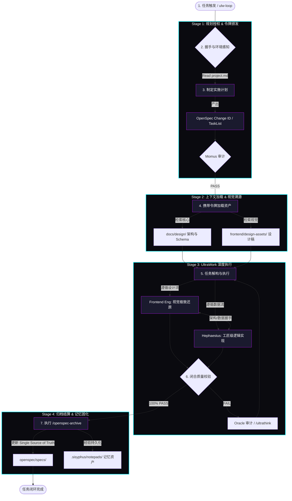

# Work-Agents AI 协作工作流指南

> **核心哲学**: 规范驱动 (OpenSpec), 任务自治 (UltraWork), 视觉溯源 (Genesis).

本文档梳理了 AI 在本项目中执行任务的完整生命周期，旨在为 AI Agent 和开发者提供清晰的协同蓝图。

## 1. 全局工作流概览 (UML Activity Diagram)

## 2. 查阅与准则对照表 (Reference Matrix)

| 阶段 | 必须查阅的文档 (Where) | 必须遵守的准则 (Standard) |
| :--- | :--- | :--- |
| **0. 启动** | `docs/guides/agentic-environment.md` | 项目 Agent 能力图谱 |
| **1. 规划** | `openspec/project.md`, `docs/requirement.md` | OpenSpec 变更协议 |
| **2. 设计** | `docs/design/` (全部文档), `frontend/design-assets/` | **Design Dominance** (设计绝对主导) |
| **3. 实现** | `docs/design/ui-ux-spec.md` | **Genesis** (视觉还原度/物理动效) |
| **4. 初始化** | `.sisyphus/notepads/` | 跨会话历史决策对齐 |
| **5. 验证** | `GEMINI.md`, `AGENTS.md` | 300/50 行限制, 闭环自检协议 |

## 3. 核心角色与职责 (The Squad)

| 角色 | 核心任务 | 关键输入 |
| :--- | :--- | :--- |
| **Sisyphus (Lead)** | 全程领航、状态维护、TODO 闭环 | `tasks.md`, `openspec/project.md` |
| **Hephaestus** | 逻辑开发、模式匹配、高性能实现 | `docs/design/`, `backend/src/` |
| **Frontend Eng** | 样式实现、动效校准、UI 验证 | `frontend/design-assets/`, `ui-ux-spec.md` |
| **Oracle** | 架构决策、疑难杂症审计、/ultrathink 代理 | `docs/adr/`, 全局上下文 |
| **Librarian/Explorer** | 外部调研、代码地图绘制、上下文减重 | 互联网、官方文档、全量源码 |

## 4. 核心准则 (Hard Constraints)

1. **规范即真相**: 任何代码改动必须有对应的 Spec 或 Proposal 支撑。
2. **设计主导**: 必须 100% 还原 `docs/design/` 中的逻辑与视觉资产。
3. **闭环验证**: 严禁在 `lint` 或 `test` 失败的情况下标记任务完成。
4. **记忆累积**: 所有的踩坑经验必须追加至 `.sisyphus/notepads/`。

---

**最后更新**: 2026-02-02
